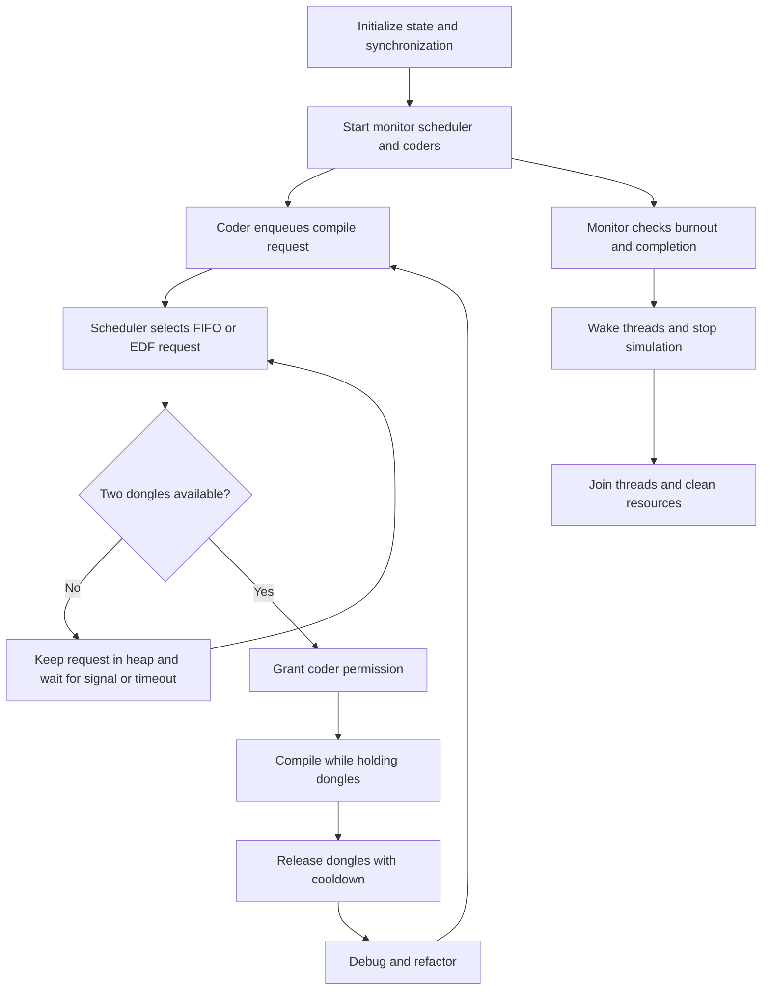

*This project has been created as part of the 42 curriculum by tokinira.*

# Description

**Codexion** is a 42 School project written in C. It simulates multiple coders competing for shared USB dongles using POSIX threads, mutexes, condition variables and a custom scheduler.

<p align="center">
   
</p>

Each coder repeatedly follows:

**compile → debug → refactor → compile**

Compiling requires two neighboring dongles simultaneously. Released dongles remain unavailable during their cooldown period.

The simulation stops when:

* a coder burns out because they did not start compiling before their deadline;
* or every coder has completed the required number of compilations.

The project implements two scheduling policies: **FIFO** and **EDF**.

# Limitations

* With one coder, only one dongle exists, so compilation is impossible because
  compilation requires two dongles. The current implementation stops this
  degenerate simulation immediately after the coder takes the dongle.
* The monitor checks burnout deadlines every millisecond. This provides the
  timing precision required for burnout logs, but it is still a lightweight
  polling loop.
* When pending requests cannot be dispatched, the scheduler waits on a
  condition variable and uses a 50 ms timeout as a deadlock-safety fallback.
  Dongle releases, new requests and simulation termination wake it earlier.

# Design and algorithm

## Design choices

1. Each coder owns one position in a ring and requests its two neighboring
   dongles before compiling.
2. Each dongle has its own mutex. Dongles are reserved in a consistent order to
   prevent circular wait and the reservation is rolled back if the second
   dongle is unavailable.
3. Compile requests are stored in a binary heap. FIFO compares arrival order;
   EDF compares burnout deadlines and then arrival order.
4. The scheduler is separated from the coder threads. It drains the request
   queue, tries to reserve dongles and grants permission only after both
   dongles are reserved.
5. Condition variables allow coders and the scheduler to sleep until a
   meaningful event occurs. Dongle cooldown is enforced with `available_at`.
6. A separate monitor checks burnout and completion, then wakes every waiting
   thread during termination.

## Algorithm flow

1. Initialize the simulation state, mutexes, condition variables, coders,
   dongles and priority queue.
2. Start the monitor, scheduler and coder threads.
3. A coder enqueues a request and waits for scheduler permission.
4. The scheduler selects requests according to FIFO or EDF, reserves the
   required dongles and signals the selected coder.
5. The coder compiles while holding both dongles, releases them, then debugs
   and refactors before requesting another compile.
6. The scheduler is awakened by a new request, a dongle release, termination,
   or its 50 ms safety timeout.
7. The monitor stops the simulation when a coder burns out or when all coders
   have completed the required number of compilations.
8. The main thread joins every worker and destroys all synchronization
   primitives and allocated resources.



# Instructions

## Compilation

```sh
make
make clean
make fclean
make re
```

The project is compiled with:

```text
-Wall -Wextra -Werror -pthread
```

## Execution

```sh
./codexion number_of_coders time_to_burnout time_to_compile time_to_debug time_to_refactor number_of_compiles_required dongle_cooldown scheduler
```

| Argument                      | Description                           |
| ----------------------------- | ------------------------------------- |
| `number_of_coders`            | Number of coders and dongles          |
| `time_to_burnout`             | Maximum time before a coder burns out |
| `time_to_compile`             | Compilation duration                  |
| `time_to_debug`               | Debugging duration                    |
| `time_to_refactor`            | Refactoring duration                  |
| `number_of_compiles_required` | Compilations required per coder       |
| `dongle_cooldown`             | Dongle cooldown duration              |
| `scheduler`                   | `fifo` or `edf`                       |

Example:

```sh
./codexion 5 800 200 200 200 3 200 fifo
./codexion 4 900 200 200 100 5 100 edf
```

## Argument validation

The program rejects:

* an incorrect number of arguments;
* invalid or overflowing numeric values;
* negative values;
* invalid scheduler names;
* fewer than one coder.

# Scheduling

### FIFO

Requests are processed according to their arrival order.

### EDF

**Earliest Deadline First** prioritizes the request with the earliest burnout deadline:

```text
deadline = last_compile_start + time_to_burnout
```

When deadlines are equal, arrival order is used as the tie-breaker.

Both policies use the project's custom binary heap priority queue.

# Testing & Debugging

The project provides ThreadSanitizer and AddressSanitizer builds for checking
thread synchronization and memory safety without changing the normal binary.

## ThreadSanitizer

Build and run the ThreadSanitizer binary:

```sh
make tsan
TSAN_OPTIONS="halt_on_error=0" ./codexion_tsan 4 3000 50 20 20 2 20 edf
```

`TSAN_OPTIONS="halt_on_error=0"` lets one run report all detected races instead
of stopping at the first report.

## AddressSanitizer

Build and run the AddressSanitizer binary to detect invalid memory accesses,
including use-after-free and buffer overflows, and to report leaks when the
platform runtime supports leak detection:

```sh
make asan
./codexion_asan 4 3000 50 20 20 2 20 edf
```

Run each sanitizer 10 to 20 times with different scenarios: one coder, multiple
coders, both `fifo` and `edf`, and tight deadlines. Thread races are
non-deterministic, so one successful run does not prove that the program is
race-free.

## AI usage

*(To be completed by the author with the actual, specific ways AI tools were used — this subsection was intentionally left as a template rather than invented, per the project's honesty requirement.)*

AI assistance was used during development for tasks such as:

* [ ] Understanding pthreads / mutexes / condition variables concepts
* [ ] Understanding FIFO vs EDF scheduling
* [ ] Debugging specific issues (describe which)
* [ ] Reviewing synchronization logic (describe which parts)
* [ ] Designing test scenarios
* [ ] Explaining compiler/runtime errors
* [ ] Generating this README from the source code (this document)

# Blocking cases handled

| Case                     | Mechanism                                                                                                   |
| ------------------------ | ----------------------------------------------------------------------------------------------------------- |
| **Deadlock**             | Dongles are reserved in a consistent order and reservations are rolled back if the pair cannot be obtained. |
| **Coffman's conditions** | Per-dongle mutexes provide mutual exclusion; fixed ordering prevents circular wait.                         |
| **Race conditions**      | Shared simulation state, queue state, logging and dongle state are protected by dedicated mutexes.          |
| **Starvation**           | Requests are ordered through FIFO or EDF priority policies.                                                 |
| **Fair arbitration**     | A custom binary heap determines which pending request is considered first.                                  |
| **Dongle cooldown**      | `available_at` prevents a dongle from being reused before its cooldown expires.                             |
| **Burnout**              | A dedicated monitor checks coder deadlines independently from coder threads.                                |
| **Log serialization**    | `log_mutex` protects every output operation.                                                                |
| **Termination**          | The simulation stops on burnout or when all coders reach the required compile count.                        |

# Thread synchronization mechanisms

| Primitive                         | Purpose                                                                  |
| --------------------------------- | ------------------------------------------------------------------------ |
| `pthread_mutex_t` per dongle      | Protects dongle availability, reservation and cooldown state.            |
| `state_mutex`                     | Protects coder state and simulation termination state.                   |
| `queue_mutex`                     | Protects the priority queue and request counter.                        |
| `pthread_cond_t cond`             | Allows each coder to wait for scheduler permission.                      |
| `pthread_cond_t queue_cond`       | Wakes the scheduler when requests are available or the simulation stops. |
| `log_mutex`                       | Serializes log output.                                                   |
| `pthread_create` / `pthread_join` | Creates and synchronizes coder, scheduler and monitor threads.           |

The main synchronization flow is:

```text
Coder
  │
  ├── enqueue request ──→ Priority Queue
  │                           │
  │                           ▼
  │                       Scheduler
  │                           │
  │                     reserve dongles
  │                           │
  │                           ▼
  └──── wait for permission ←─┘
              │
              ▼
          Compile
              │
              ▼
      Release + cooldown
              │
              ▼
       Debug → Refactor
```

The monitor independently checks coder state and can stop the simulation by updating the shared termination state and waking waiting threads.

### Waiting strategy

Coders wait on their own condition variable until the scheduler grants permission
or the simulation stops. The scheduler waits on `queue_cond` when the queue is
empty and uses `pthread_cond_timedwait` when pending requests are blocked by
dongle availability. A new request, a dongle release or termination wakes it
before the 50 ms safety timeout.

### Why `pthread_cond_wait` is always called inside a loop

Per the POSIX specification, `pthread_cond_wait` may return even when no thread has signaled the condition variable — these are called **spurious wakeups** — and a signaled thread is never guaranteed to be the one that re-checks the shared state first. For this reason, the predicate must always be re-evaluated in a loop after waking up:

```c
pthread_mutex_lock(&mutex);
while (!condition)
    pthread_cond_wait(&cond, &mutex);
/* condition is now guaranteed true */
pthread_mutex_unlock(&mutex);
```

References:
* [`pthread_cond_wait(3p)` — POSIX.1-2017 / Open Group Base Specifications](https://pubs.opengroup.org/onlinepubs/9699919799/functions/pthread_cond_wait.html)
* [`pthread_cond_wait(3)` — Linux man-pages](https://man7.org/linux/man-pages/man3/pthread_cond_wait.3.html)

# Architecture

| File                   | Responsibility                            |
| ---------------------- | ------------------------------------------ |
| `main.c`               | Program entry point and argument handling |
| `parsing.c`            | Argument validation and configuration     |
| `time.c`               | Millisecond timestamps                    |
| `init.c`               | Simulation initialization                 |
| `cleanup.c`            | Resource destruction and memory cleanup   |
| `states.c`             | Shared state and request management       |
| `simulation.c`         | Thread creation and joining               |
| `coder.c`              | Coder thread lifecycle                    |
| `coder_acquire.c`      | Coder requests and dongle acquisition    |
| `coder_cycle.c`        | Compile, debug and refactor cycle        |
| `dongle.c`             | Dongle reservation and cooldown           |
| `scheduler.c`          | Scheduler thread                          |
| `scheduler_dispatch.c` | Request dispatching                       |
| `monitor.c`            | Burnout and completion monitoring         |
| `logging.c`            | Synchronized logging                      |
| `queue/`               | Binary heap and FIFO/EDF ordering         |

# Concurrency model

Each coder follows:

```text
Request
   ↓
Wait for permission
   ↓
Acquire two dongles
   ↓
Compile
   ↓
Release dongles
   ↓
Debug
   ↓
Refactor
   ↓
Request again
```

The scheduler manages pending compile requests, while the monitor independently watches burnout deadlines and simulation completion.

# Memory management

All dynamically allocated simulation resources are released during cleanup:

* coder data;
* thread handles;
* dongles;
* priority queue;
* temporary scheduler/context allocations.

Mutexes and condition variables are destroyed before their associated memory is freed.

# Error handling

Initialization and thread creation failures are checked and propagated.

Already-created synchronization primitives and allocated resources are cleaned up when an initialization step fails.

Invalid command-line arguments are rejected before the simulation starts.

# Project structure

```text
codexion/
├── Makefile
├── assets/
│   └── Codexion_ Dining Philosophers.png
├── includes/
│   └── codexion.h
├── srcs/
│   ├── main.c
│   ├── parsing.c
│   ├── time.c
│   ├── init.c
│   ├── cleanup.c
│   ├── states.c
│   ├── simulation.c
│   ├── coder.c
│   ├── coder_acquire.c
│   ├── coder_cycle.c
│   ├── dongle.c
│   ├── scheduler.c
│   ├── scheduler_dispatch.c
│   ├── monitor.c
│   ├── logging.c
│   └── queue/
│       ├── priority_queue.c
│       └── priority_queue_heap.c
└── debug/
   ├── debug_edf_burnout.md
   └── debug_scheduler_codexion.md
```